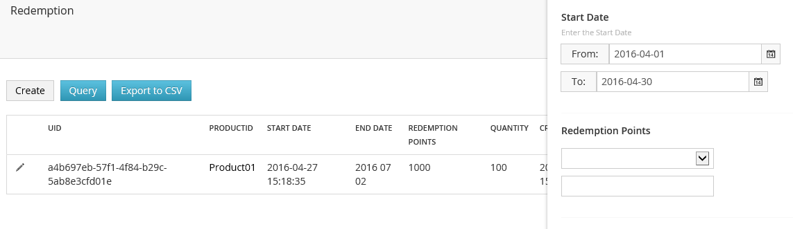
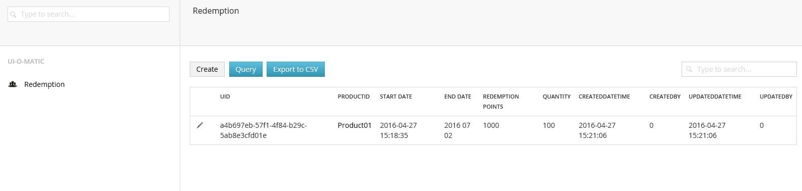

# UI-O-Matic 2 #

**Auto generate an integrated crud UI in Umbraco for a db table based on a [petapoco ](http://www.toptensoftware.com/petapoco/)poco**

Implement an interface and decorate your class and properties with some additional attributes.
## What's new in UI-O-Matic 2 ##
##### 1.Format column header to match UIOMaticField name.
##### 2.Export to CSV file.
##### 3.Readonly for listview.

    [UIOMaticAttribute("Redemption", "icon-users", "icon-user",RenderType = UIOMaticRenderType.List, IsCanExport = true, ReadOnly = false)]
    
##### 4.Hide it in the left side menu. 
`[UIOMaticAttribute("RedemptionRecord", "icon-users", "icon-user", RenderType = UIOMaticRenderType.List, ShowInTree = false)]`
##### 5.Added Query featrue.

`[UIOMaticFilterField(DefaultValue = "monthlyfirstday", DefaultToValue = "monthlylastday")]`
    
    
##### 6.Default ordering with descing or ascing.

`[UIOMaticSortOrder(2, true)]`

##### 7.Datetime format in the listview using UIOMaticField attribute.
`[UIOMaticField("End Date", "Enter the End Date", IsCanEdit = false,DateFormat ="yyyy MM dd")]`

##### 8.Not allow change the value once the record created.
    [UIOMaticField("Uid", "", IsCanEdit = false)]
## Example ##
If you have the following db table

    CREATE TABLE [Redemption] (
      [Uid] uniqueidentifier DEFAULT (newid()) NOT NULL
    , [ProductID] nvarchar(100) NULL
    , [StartDateTime] datetime NOT NULL
    , [EndDateTime] datetime NOT NULL
    , [RedemptionPoint] int NOT NULL
    , [Quantity] int NOT NULL
    , [CreatedDateTime] datetime NOT NULL
    , [CreatedBy] int NOT NULL
    , [UpdatedDateTime] datetime NOT NULL
    , [UpdatedBy] int NOT NULL
    , [Status] nvarchar(50) NULL
    );
    GO
    ALTER TABLE [Redemption] ADD CONSTRAINT [PK_Redemption] PRIMARY KEY ([Uid]);
    GO
    CREATE TABLE [RedemptionRecord] (
      [Uid] uniqueidentifier DEFAULT (newid()) NOT NULL
    , [RedemptionID] uniqueidentifier NOT NULL
    , [ConfirmedDateTime] datetime NULL
    , [CollectedDateTime] datetime NULL
    , [CreatedDateTime] datetime DEFAULT (getdate()) NOT NULL
    , [CreatedBy] int NOT NULL
    , [UpdatedDateTime] datetime DEFAULT (getdate()) NOT NULL
    , [UpdatedBy] int NOT NULL
    , [Status] nvarchar(50) NOT NULL
    , [CollectionExpiryDateTime] datetime NULL
    );
    GO
    ALTER TABLE [RedemptionRecord] ADD CONSTRAINT [PK_RedemptionRecord] PRIMARY KEY ([Uid]);
    GO

This class

    [UIOMaticAttribute("Redemption", "icon-users", "icon-user",
        RenderType = UIOMaticRenderType.List, IsCanExport = true, ReadOnly = false)]
    [TableName("Redemption")]
    [PrimaryKey("Uid", autoIncrement = false)]
    [ExplicitColumns]
    public class Redemption : IUIOMaticModel
    {
        public const string TableName = "Redemption";
        [UIOMaticIgnoreField]
        [UIOMaticField("Uid", "", IsCanEdit = false)]
        [Column]
        public Guid Uid { get; set; }
        [UIOMaticNameField]
        [Column]
        public string ProductID { get; set; }
        [UIOMaticField("Start Date", "Enter the Start Date", IsCanEdit = false)]
        [UIOMaticFilterField(DefaultValue = "monthlyfirstday", DefaultToValue = "monthlylastday")]
        [UIOMaticSortOrder(1)]
        [Column]
        public DateTime StartDateTime { get; set; }
        [UIOMaticField("End Date", "Enter the End Date", IsCanEdit = false,DateFormat ="yyyy MM dd")]
        [Column]
        public DateTime EndDateTime { get; set; }
        [UIOMaticField("Redemption Points", "", IsCanEdit = false)]
        [UIOMaticFilterField]
        [Column]
        public int RedemptionPoint { get; set; }
        [UIOMaticField("Quantity", "", IsCanEdit = false)]
        [Column]
        public int Quantity { get; set; }

        [UIOMaticField("CreatedDateTime", "", View = "datetime", IsCanEdit = false)]
        [UIOMaticIgnoreField]
        [Column]
        [UIOMaticSortOrder(2, true)]
        public DateTime CreatedDateTime { get; set; }
        //[UIOMaticField("CreatedBy", "", IsCanEdit = false)]
        [UIOMaticIgnoreField]
        [Column]
        public int CreatedBy { get; set; }
        [UIOMaticField("UpdatedDateTime", "", View = "datetime", IsCanEdit = false)]
        [UIOMaticIgnoreField]
        [Column]
        public DateTime UpdatedDateTime { get; set; }
        //[UIOMaticField("UpdatedBy", "", IsCanEdit = false)]
        [UIOMaticIgnoreField]
        [Column]
        public int UpdatedBy { get; set; }

        [Ignore]
        [UIOMaticIgnoreFromListView]
        [UIOMaticField("Winner", "", View = "list",
            Config = "{'typeName': 'Example.Model.RedemptionRecord, Example', 'foreignKeyColumn' : 'RedemptionID', 'canEdit' : true}")]
        public IEnumerable<RedemptionRecord> Winner { get; set; }

        public override string ToString()
        {
            return ProductID;
        }

        public IEnumerable<Exception> Validate()
        {
            var exs = new List<Exception>();

            if (string.IsNullOrEmpty(ProductID))
                exs.Add(new Exception("Please provide a value for Product Code"));

            if (Quantity < 0)
                exs.Add(new Exception("Please provide a value for Quantity"));

            return exs;
        }

        public void SetDefaultValue()
        {
            if (CreatedDateTime == default(DateTime))
            {
                CreatedDateTime = DateTime.Now;
                CreatedBy = 0;
            }
            UpdatedDateTime = DateTime.Now;
            UpdatedBy = 0;
        }
    }
     [UIOMaticAttribute("RedemptionRecord", "icon-users", "icon-user", RenderType = UIOMaticRenderType.List, ShowInTree = false)]
     [TableName("RedemptionRecord")]
     [PrimaryKey("Uid", autoIncrement = false)]
     [ExplicitColumns]
     public partial class RedemptionRecord : IUIOMaticModel
     {
         public const string TableName = "RedemptionRecord";
 
         [UIOMaticIgnoreField]
         [UIOMaticIgnoreFromListView]
         [Column]
         public Guid Uid { get; set; }
         [UIOMaticIgnoreField]
         [UIOMaticIgnoreFromListView]
         [Column]
         public Guid RedemptionID { get; set; }
 
         [Column("CreatedBy")]
         public int Winner { get; set; }
         [Column]
         [UIOMaticField("Confirmed DateTime", "", View = "datetime", IsCanEdit = false)]
         public DateTime? ConfirmedDateTime { get; set; }
         [Column]
         public DateTime? CollectedDateTime { get; set; }
         [Column]
         [UIOMaticField("Collection Expiry DateTime", "", View = "datetime", IsCanEdit = false)]
         public DateTime? CollectionExpiryDateTime { get; set; }
         [UIOMaticIgnoreField]
         [UIOMaticIgnoreFromListView]
         [Column]
         public DateTime CreatedDateTime { get; set; }
 
         [UIOMaticIgnoreField]
         [UIOMaticIgnoreFromListView]
         [Column]
         public DateTime UpdatedDateTime { get; set; }
         [UIOMaticIgnoreField]
         [UIOMaticIgnoreFromListView]
         [Column]
         public int UpdatedBy { get; set; }
         
         public override string ToString()
         {
             return Winner.ToString();
         }
 
         public IEnumerable<Exception> Validate()
         {
             var exs = new List<Exception>();
             
             return exs;
         }
 
 
         public void SetDefaultValue()
         {
             if (CreatedDateTime == default(DateTime))
             {
                 CreatedDateTime = DateTime.Now;
                 Winner = 0;
             }
             UpdatedDateTime = DateTime.Now;
             UpdatedBy = 0;
         } 
     }   `

Will generate the following UI

## Documentation ##

For docs please go to[ http://uiomatic.readthedocs.org/](http://uiomatic.readthedocs.org/)

## Presentation ##
For the quick intro check [http://slides.com/timgeyssens/uiomatic#/](http://slides.com/timgeyssens/uiomatic#/)

### Test site ###
Backoffice credentials: 
- bennylam@hotmail.com / P@ssw0rd

